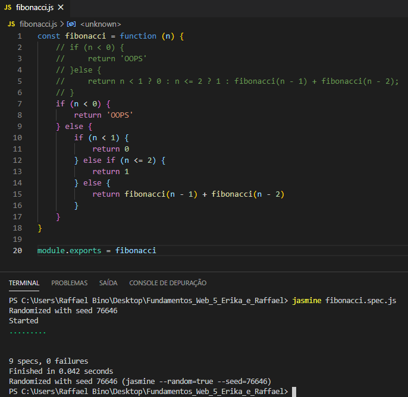
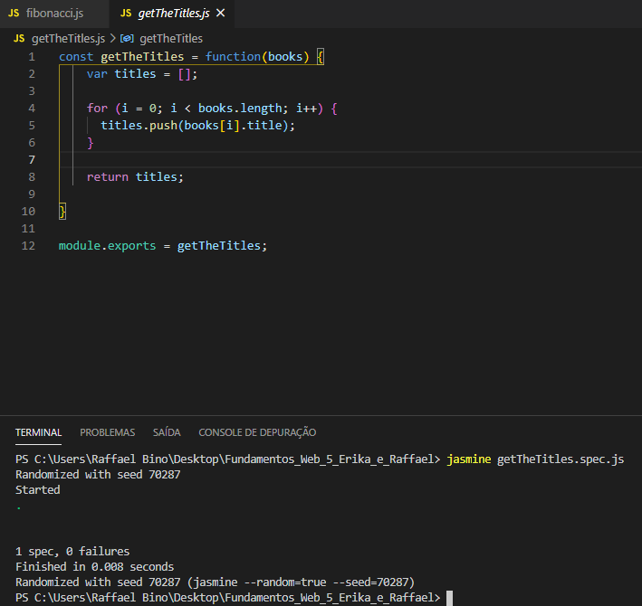
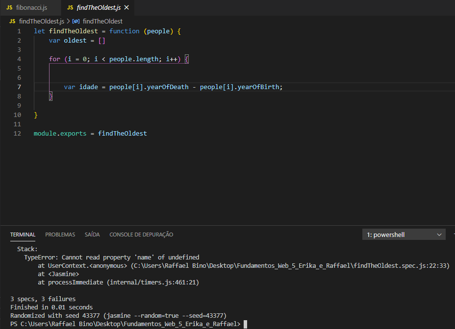
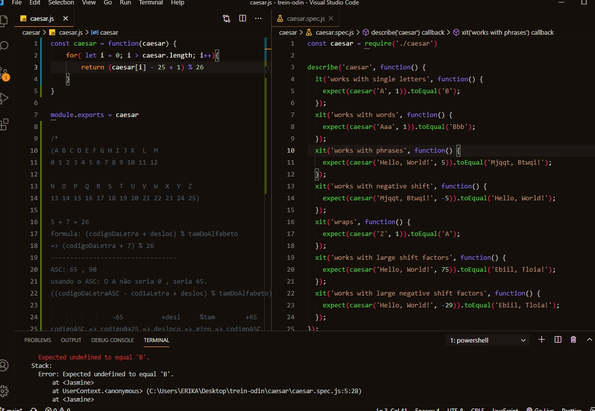
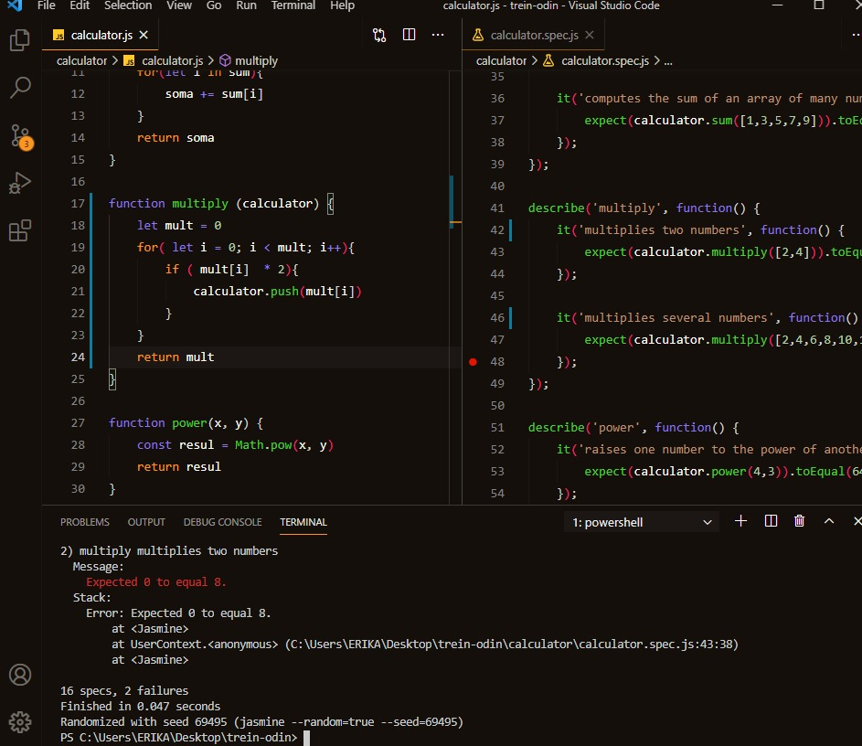
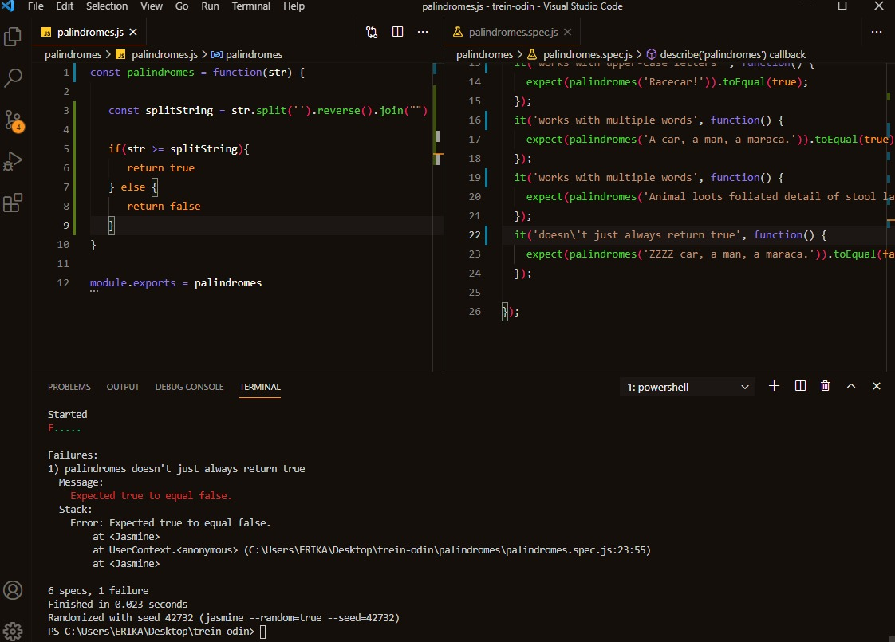

# Fundamentos_Web_5_Erika_e_Raffael
<h3>Código e o Resultado de Sucesso no TDD do Fibonacci</h3>

<h3>Código e o Resultado de Sucesso no TDD do getTheTitle</h3>

<h3>Código e o Resultado de Falha no TDD do findTheOldest</h3>

Não consegui fazer esse exercício

<h1>Parte Erika</h1>

Exercicio Ceasar

Exercicio Calculator

Exercicio Palindromes

